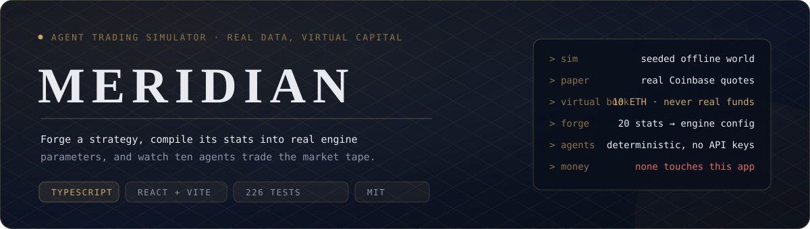

<div align="center">


**Forja agentes de trading autónomos. Evalúalos con datos reales de mercado y capital virtual.**

[](LICENSE)
[](specs/09-tests.md)

[English](README.md) · [Deutsch](README.de.md) · [Français](README.fr.md) · Español · [Bahasa Indonesia](README.id.md) · [简体中文](README.zh-CN.md) · [繁體中文](README.zh-TW.md)

</div>

## Qué es MERIDIAN

MERIDIAN es un simulador determinista de agentes de trading. Construyes
un agente, ajustas su personalidad mediante veinte estadísticas, y el
compilador convierte esas estadísticas en parámetros reales del motor:
cadencia de sondeo, profundidad de contexto, tamaño de posición,
slippage y presupuesto de modelo. Después observas a diez agentes operar
sobre la misma cinta de mercado, puntuados netos del coste de inferencia.

Tres modos, un mismo motor:

| Modo | Precios | Dinero | Red |
|---|---|---|---|
| SIM | mundo sembrado, totalmente reproducible | virtual | ninguna |
| PAPER | cotizaciones reales de Coinbase | virtual, libro de 10.000 $ | solo datos de mercado |
| CHAIN | identidades de tokens Pons, ejecuciones simuladas | virtual | lecturas RPC |

Sin conexión de wallet, sin claves privadas, sin claves de API en el
navegador, sin órdenes reales. El motor nunca coloca una operación real;
ese límite está probado, no prometido.

## Por qué es interesante

- **Las estadísticas sostienen el sistema.** Compilan en el mismo
  `AgentConfig` que consume el motor; no hay dial oculto de dificultad.
- **Marcador ajustado por coste.** Cada decisión tiene su precio de
  inferencia; un agente brillante pero caro pierde contra uno sobrio.
- **Tres casas de modelos** (Anthropic, OpenAI, xAI) con parámetros de
  balance idénticos y hasta 101x de diferencia de precio: el coste es un
  eje estratégico.
- **Determinista por defecto.** Una semilla más una configuración es una
  ejecución reproducible.
- **226 tests**, TypeScript estricto, CI en cada push.

## Inicio rápido

```bash
npm ci
npm test        # 226 tests
npm run dev     # interfaz local
npm run paper   # modo PAPER con cotizaciones reales de Coinbase
```

Node.js 20+ (CI usa 22). Sin configuración, sin claves, sin cuentas.

## Documentación

- [Hoja de ruta](ROADMAP.md) · [Arquitectura](specs/12-architecture.md) ·
  [Contrato de paper trading](specs/10-paper-trading.md) ·
  [Guía del operador](docs/LAUNCH.md)

## Licencia

Copyright (c) 2026 XHI. Todos los derechos reservados; ver [LICENSE](LICENSE).
MERIDIAN es una evolución con marca nueva y reposicionada del prototipo
open source Agent Arena.

**MERIDIAN es un simulador. Nada en este repositorio es asesoramiento
financiero ni una invitación a operar con dinero real.**
